# Selfx402Pay - Consumer Payment Demo

**Self Protocol + x402 Payment Integration** - Proof-of-unique-human verification with instant gasless USDC micropayments on Celo.


## 🎯 Overview

Selfx402Pay is a Next.js consumer application demonstrating the integration of:
- **Self Protocol**: Zero-knowledge passport verification for proof-of-unique-human
- **x402 Protocol**: HTTP-native crypto micropayments with EIP-712 signatures
- **Celo Network**: Low-cost, fast blockchain with gasless USDC transfers

This creates a **tiered pricing model** where verified humans pay 1000-2000x less than bots, enabling fair API access without traditional authentication.

### Key Features

✅ **Self Protocol QR Verification** - One-time passport scan for human verification
✅ **x402 Instant Payments** - Sub-second USDC micropayments without gas fees
✅ **Tiered Pricing** - Bot ($1.00) vs Human ($0.001) pricing
✅ **Wagmi Integration** - Modern Web3 wallet connection with RainbowKit
✅ **Payment Widget** - Pre-built React component (`selfx402-pay-widget`)
✅ **TypeScript** - Full type safety with Next.js 14

---

## 🏗️ Architecture

### System Overview


### Component Architecture


---

## 🔄 Payment Flow

### Complete Payment Sequence

```mermaid
sequenceDiagram
    actor User
    participant App as Next.js App
    participant Widget as Payment Widget
    participant Wallet as Web3 Wallet
    participant SelfApp as Self Mobile App
    participant Vendor as Vendor API
    participant Facilitator as Selfx402 Facilitator
    participant Celo as Celo Network

    %% Self Protocol Verification Flow
    Note over User,SelfApp: Phase 1: Self Protocol Verification
    User->>App: Open payment page
    App->>Widget: Render PaymentForm
    Widget->>Widget: Generate QR code
    Widget-->>User: Display QR code
    User->>SelfApp: Scan QR with Self app
    SelfApp->>SelfApp: Read passport NFC
    SelfApp->>SelfApp: Generate ZK proof
    SelfApp->>Facilitator: POST /api/verify (proof)
    Facilitator->>Facilitator: Verify ZK proof
    Facilitator-->>SelfApp: ✅ Verification success
    SelfApp-->>Widget: Callback with verification data
    Widget->>Widget: Store proof in localStorage
    Widget->>Widget: Enable "Sign Payment" button

    %% x402 Payment Flow
    Note over User,Celo: Phase 2: x402 Payment Flow
    User->>Widget: Click "Sign Payment"
    Widget->>Wallet: Request wallet connection
    Wallet-->>User: Prompt to connect
    User->>Wallet: Approve connection
    Wallet-->>Widget: Connected (address)

    Widget->>Vendor: GET /.well-known/x402
    Vendor-->>Widget: Payment config (price, network)

    Widget->>Widget: Create EIP-712 payment authorization
    Widget->>Wallet: Request EIP-712 signature
    Wallet-->>User: Display signature request
    User->>Wallet: Approve signature
    Wallet-->>Widget: Signed payment envelope

    Widget->>Vendor: POST /api/demo + X-Payment header
    Vendor->>Facilitator: POST /verify-celo (envelope)
    Facilitator->>Facilitator: Verify EIP-712 signature
    Facilitator-->>Vendor: ✅ Signature valid

    Vendor->>Facilitator: POST /settle-celo (envelope)
    Facilitator->>Celo: transferWithAuthorization (EIP-3009)
    Celo->>Celo: Transfer USDC (gasless)
    Celo-->>Facilitator: ✅ Transfer complete (txHash)
    Facilitator-->>Vendor: Settlement data

    Vendor->>Vendor: Process protected request
    Vendor-->>Widget: API response + settlement proof
    Widget->>Widget: Show success screen
    Widget-->>User: Display transaction details
```



---

## 🚀 Getting Started

### Prerequisites

- Node.js 18+ and npm/yarn
- Web3 wallet (MetaMask, Coinbase Wallet, etc.)
- Self mobile app (iOS/App Store, Android/Play Store)
- Real passport for Self verification
- USDC on Celo mainnet (for payments)

### Installation

1. **Clone the repository**
```bash
git clone https://github.com/CodaLabs-xyz/Selfx402Pay.git
cd Selfx402Pay
```

2. **Install dependencies**
```bash
npm install
```

3. **Configure environment variables**

Copy `.env.example` to `.env` and configure:

```bash
# Self Protocol Verification
NEXT_PUBLIC_SELF_ENDPOINT=https://your-facilitator-url.ngrok.io/api/verify
NEXT_PUBLIC_SELF_APP_NAME="Self x402 Pay"
NEXT_PUBLIC_SELF_SCOPE="self-x402-facilitator"

# Payment Configuration
NEXT_PUBLIC_FACILITATOR_URL=https://your-facilitator-url.ngrok.io
NEXT_PUBLIC_VENDOR_API_URL=http://localhost:3000

# Blockchain Configuration
NEXT_PUBLIC_USDC_ADDRESS=0xcebA9300f2b948710d2653dD7B07f33A8B32118C

# Optional: WalletConnect
NEXT_PUBLIC_WALLETCONNECT_PROJECT_ID=your_project_id_here
```

**Important**:
- `NEXT_PUBLIC_SELF_ENDPOINT` must be publicly accessible (use ngrok for local development)
- `NEXT_PUBLIC_SELF_SCOPE` must match your Facilitator configuration
- Get WalletConnect Project ID at https://cloud.walletconnect.com

4. **Run development server**
```bash
npm run dev
```

Open [http://localhost:3000](http://localhost:3000) to see the application.

### Required Services

**Selfx402 Facilitator** (must be running):
```bash
# In separate terminal
cd ../Selfx402Facilitator
PORT=3005 npx tsx index.ts
```

**Vendor API** (optional, for testing payments):
```bash
# In separate terminal
cd ../Vendors/Places-x402-Api
npm run dev
```

---

## 📦 Project Structure

```
Selfx402Pay/
├── app/
│   ├── layout.tsx          # Root layout with providers
│   ├── page.tsx            # Main payment demo page
│   └── globals.css         # Global styles
├── components/
│   ├── self-verification.tsx  # Standalone Self verification demo
│   ├── providers.tsx       # Wagmi + RainbowKit providers
│   └── ui/                 # shadcn/ui components
├── public/
│   └── selfPay.png         # Logo asset
├── .env.example            # Environment template
├── package.json            # Dependencies
└── README.md              # This file
```

---

## 🎨 Usage Examples

### Basic Payment Form (Regular Version)

```tsx
import { PaymentForm, type WagmiConfig } from "selfx402-pay-widget"
import { useAccount, useSignTypedData, useChainId, useConfig } from 'wagmi'

export default function PaymentPage() {
  const wagmiConfig = useConfig()
  const { address, isConnected } = useAccount()
  const chainId = useChainId()
  const { signTypedDataAsync } = useSignTypedData()

  const wagmiConfigProp: WagmiConfig = {
    config: wagmiConfig,
    address,
    isConnected,
    chainId,
    signTypedDataAsync,
    readContract: async (args) => {
      const result = await readContract(args)
      return result.data
    }
  }

  return (
    <PaymentForm
      wagmiConfig={wagmiConfigProp}
      vendorUrl="https://api.vendor.com"
      apiEndpoint="/api/protected-resource"
      facilitatorUrl="https://facilitator.selfx402.xyz"
      selfEndpoint="https://facilitator.selfx402.xyz/api/verify"
      selfAppName="My App"
      selfScope="my-app-scope"
      queryParams={{ format: "json" }}
      onPaymentSuccess={(data) => {
        console.log('Payment successful:', data)
      }}
      onPaymentError={(error) => {
        console.error('Payment failed:', error)
      }}
    />
  )
}
```

### Minimal Payment Form (Compact Version)

```tsx
import { PaymentFormMinimal } from "selfx402-pay-widget"

export default function CompactPayment() {
  return (
    <PaymentFormMinimal
      wagmiConfig={wagmiConfigProp}
      vendorUrl="https://api.vendor.com"
      apiEndpoint="/api/demo"
      // ... other required props
    />
  )
}
```

### Standalone Self Verification

```tsx
import SelfVerification from "@/components/self-verification"

export default function VerificationPage() {
  return (
    <SelfVerification
      selfEndpoint="https://facilitator.selfx402.xyz/api/verify"
      selfAppName="My App"
      selfScope="my-app-scope"
      userAddress="0x..."
      onVerificationSuccess={(nullifier) => {
        console.log('Verified! Nullifier:', nullifier)
      }}
    />
  )
}
```

---

## 🔧 Configuration

### Environment Variables

| Variable | Required | Description |
|----------|----------|-------------|
| `NEXT_PUBLIC_SELF_ENDPOINT` | ✅ | Self Protocol verification endpoint (must be public) |
| `NEXT_PUBLIC_SELF_APP_NAME` | ✅ | Display name in Self mobile app |
| `NEXT_PUBLIC_SELF_SCOPE` | ✅ | Unique app identifier (max 30 chars) |
| `NEXT_PUBLIC_FACILITATOR_URL` | ✅ | Selfx402Facilitator base URL |
| `NEXT_PUBLIC_VENDOR_API_URL` | ✅ | Vendor API base URL |
| `NEXT_PUBLIC_USDC_ADDRESS` | ✅ | USDC contract address on Celo |
| `NEXT_PUBLIC_WALLETCONNECT_PROJECT_ID` | ❌ | WalletConnect project ID (optional) |

### Widget Configuration

The `selfx402-pay-widget` package accepts the following props:

```typescript
interface PaymentFormProps {
  wagmiConfig: WagmiConfig           // Wagmi configuration object
  vendorUrl: string                  // Vendor API base URL
  apiEndpoint: string                // Protected API endpoint path
  facilitatorUrl?: string            // Facilitator URL (optional)
  selfEndpoint?: string              // Self verification endpoint (optional)
  selfAppName?: string               // Self app display name (optional)
  selfScope?: string                 // Self app scope identifier (optional)
  queryParams?: Record<string, any>  // Query parameters for GET requests
  requestBody?: Record<string, any>  // Request body for POST/PUT requests
  httpMethod?: 'GET' | 'POST' | 'PUT' | 'DELETE'  // HTTP method (default: GET)
  onPaymentSuccess?: (data: PaymentSuccessData) => void
  onPaymentError?: (error: Error) => void
  onVerificationSuccess?: (nullifier: string) => void
}
```

---

## 🧪 Testing

### Manual Testing Checklist

**Self Protocol Verification**:
1. ✅ Open payment form
2. ✅ QR code displays automatically
3. ✅ Scan QR with Self mobile app
4. ✅ Complete passport NFC scan
5. ✅ Verify success callback
6. ✅ Check "Sign Payment" button enabled

**x402 Payment Flow**:
1. ✅ Click "Sign Payment"
2. ✅ Connect Web3 wallet
3. ✅ Sign EIP-712 payment authorization
4. ✅ Verify payment processing (3-30s)
5. ✅ Check success screen with transaction details
6. ✅ Verify USDC transfer on Celoscan

**Test Credentials**:
- Real passport required (no test mode for Self Protocol)
- USDC on Celo mainnet (get from exchanges or swap CELO)
- Web3 wallet with Celo network configured

### Troubleshooting

**QR Code Not Displaying**:
- Check `NEXT_PUBLIC_SELF_ENDPOINT` is publicly accessible
- Verify `NEXT_PUBLIC_SELF_SCOPE` matches Facilitator config
- Check browser console for errors

**Self Verification Fails**:
- Ensure Selfx402Facilitator is running
- Check facilitator logs for verification errors
- Verify passport meets requirements (age ≥18, not blocked country)

**Payment Signature Fails**:
- Check wallet is connected to Celo mainnet (Chain ID: 42220)
- Verify USDC balance ≥ payment amount
- Check vendor API is accessible

**Payment Settlement Fails**:
- Verify Facilitator has private key with ETH for gas
- Check USDC contract address is correct
- Review Facilitator logs for settlement errors

---

## 🏗️ Development

### Build Commands

```bash
# Development
npm run dev              # Start dev server (http://localhost:3000)

# Production
npm run build            # Next.js production build
npm start                # Start production server

# Code Quality
npm run lint             # ESLint check
```

### Adding New Features

**Custom Payment Endpoints**:
1. Configure vendor API with new endpoint
2. Update `apiEndpoint` prop in PaymentForm
3. Pass required `queryParams` or `requestBody`

**Custom Verification Logic**:
1. Implement `onVerificationSuccess` callback
2. Store nullifier in database
3. Use for tiered pricing logic

**Styling Customization**:
1. Widget uses Tailwind CSS classes
2. Override styles in `globals.css`
3. Customize theme in `tailwind.config.ts`

---

## 📚 Dependencies

### Core Technologies

- **Next.js 14** - React framework with App Router
- **TypeScript** - Type-safe JavaScript
- **Tailwind CSS 4** - Utility-first CSS framework

### Web3 Integration

- **Wagmi 2.x** - React hooks for Ethereum
- **Viem** - TypeScript Ethereum library
- **RainbowKit** - Wallet connection UI
- **Ethers.js 6** - Ethereum library

### Self Protocol

- **@selfxyz/qrcode** - QR code generation for verification
- **@selfxyz/common** - Common utilities

### Payment Widget

- **selfx402-pay-widget** - Pre-built payment component
- Includes Self verification + x402 payment flow

### UI Components

- **Radix UI** - Accessible component primitives
- **shadcn/ui** - Re-usable component library
- **Lucide React** - Icon library
- **Sonner** - Toast notifications

---

## 🌐 Deployment

### Vercel (Recommended)

```bash
npm run build
vercel deploy
```

**Environment Variables** (set in Vercel dashboard):
- Copy all `NEXT_PUBLIC_*` variables from `.env`
- Ensure `NEXT_PUBLIC_SELF_ENDPOINT` points to public facilitator URL
- Add custom domain if needed

### Docker

```dockerfile
FROM node:18-alpine
WORKDIR /app
COPY package*.json ./
RUN npm install
COPY . .
RUN npm run build
EXPOSE 3000
CMD ["npm", "start"]
```

```bash
docker build -t selfx402pay .
docker run -p 3000:3000 --env-file .env selfx402pay
```

### Important Deployment Notes

1. **Public Endpoints Required**:
   - Self verification endpoint must be publicly accessible
   - Use production facilitator URL (no ngrok in production)

2. **Security Considerations**:
   - Never commit `.env` files
   - All `NEXT_PUBLIC_*` variables are exposed to browser
   - Sensitive config goes in vendor API, not frontend

3. **Network Configuration**:
   - Ensure Celo mainnet (Chain ID: 42220) is supported
   - USDC contract: `0xcebA9300f2b948710d2653dD7B07f33A8B32118C`

---

## 🔗 Related Projects

- **[selfx402-pay-widget](https://www.npmjs.com/package/selfx402-pay-widget)** - Payment widget NPM package
- **[selfx402-framework](https://www.npmjs.com/package/selfx402-framework)** - Facilitator framework
- **[Selfx402Facilitator](https://github.com/CodaLabs-xyz/Selfx402Facilitator)** - Payment verification service
- **[Self Protocol Docs](https://docs.self.xyz)** - Official Self documentation
- **[x402 Protocol Docs](https://x402.gitbook.io/x402)** - Official x402 documentation

---

## 📖 Documentation

### Official Docs

- **Self Protocol**: https://docs.self.xyz
  - [Quickstart](https://docs.self.xyz/use-self/quickstart)
  - [Frontend SDK](https://docs.self.xyz/frontend-integration/qrcode-sdk)
  - [Backend Integration](https://docs.self.xyz/backend-integration)

- **x402 Protocol**: https://x402.gitbook.io/x402
  - [HTTP 402 Overview](https://x402.gitbook.io/x402/core-concepts/http-402)
  - [Facilitator Guide](https://x402.gitbook.io/x402/core-concepts/facilitator)
  - [Network Support](https://x402.gitbook.io/x402/core-concepts/network-and-token-support)

- **Celo Network**: https://docs.celo.org
  - [Celo Overview](https://docs.celo.org/protocol)
  - [USDC on Celo](https://docs.celo.org/protocol/tokens/stable-coins)

### Technical References

- **EIP-712**: https://eips.ethereum.org/EIPS/eip-712 (Typed Data Signing)
- **EIP-3009**: https://eips.ethereum.org/EIPS/eip-3009 (Gasless USDC Transfers)

---

## 🤝 Contributing

Contributions welcome! Please follow these guidelines:

1. Fork the repository
2. Create feature branch (`git checkout -b feature/amazing-feature`)
3. Commit changes (`git commit -m 'Add amazing feature'`)
4. Push to branch (`git push origin feature/amazing-feature`)
5. Open Pull Request

**Code Style**:
- TypeScript with strict mode
- ESLint configuration included
- Prettier for formatting
- Conventional commit messages

---

## 📄 License

MIT License - see [LICENSE](LICENSE) file for details.

---

## 🙋 Support

**Issues**: https://github.com/CodaLabs-xyz/Selfx402Pay/issues

**Contact**:
- Email: contact@zknexus.xyz
- Website: https://www.zknexus.xyz
- Twitter: [@zkNexus](https://twitter.com/zkNexus)

---

## 🏆 Credits

Built with ❤️ by [zkNexus](https://www.zknexus.xyz)

**Contributors**:
- [Julio M Cruz](https://github.com/JulioMCruz)

**Powered by**:
- [Self Protocol](https://www.self.xyz) - Zero-knowledge identity verification
- [x402 Protocol](https://x402.org) - HTTP-native crypto payments
- [Celo Network](https://celo.org) - Mobile-first blockchain

---

**⚡ Built during Self ZK Residency (Oct 14-31, 2025)**

> "Verify once, pay instantly, access everything"
